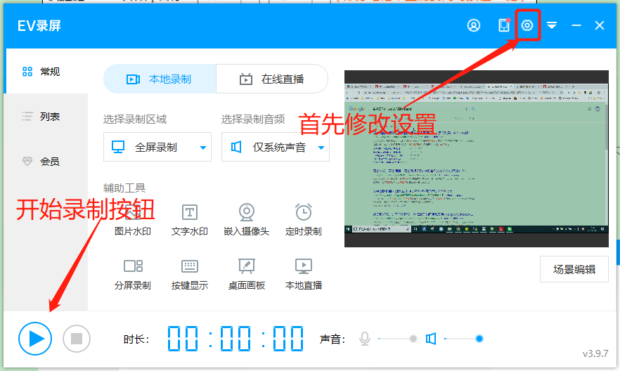
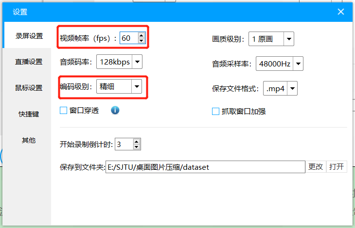
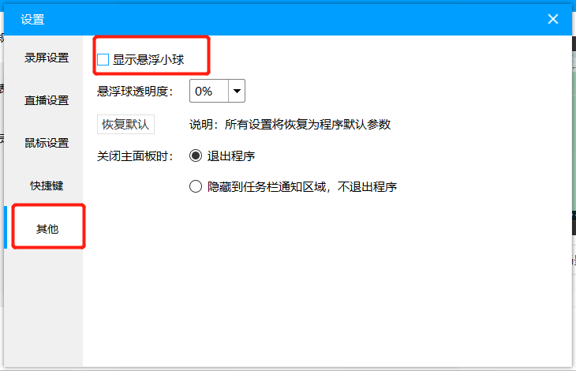

# 录屏制作数据集-操作流程  :
老师和西安的企业想要实现电脑图片压缩（与自然图像不同，见文末），所以需要自己制作数据集。考虑到数据集要丰富、多样，所以想请大家帮个忙（十分钟左右就行）。
## 思路如下：

1. 通过录屏软件录制日常的电脑使用场景（**大家只需做这一步**）  
2. 编写脚本逐帧截图  
3. 搭模型、训练、优化  

### 1.安装录屏软件
推荐EV录屏（没有广告、水印、软件不大、支持各平台）  

[下载地址](https://www.ieway.cn/evcapture.html "ev录屏下载地址")

### 2.设置录屏软件（以保证录制视频的高清晰度）

   

    
  
  

### 3.录制内容（每项10秒左右就行，顺序任意）
- 	打开桌面（含图标）
- 	打开浏览器、随便浏览2个网页
- 	打开某word文档，翻页、关闭
- 	打开某ppt、翻页、关闭
- 	打开Excel、翻页、关闭
- 	打开音乐播放器（若有）、关闭
- 	打开视频播放器、播放某视频、关闭
- 	打开某篇论文、翻页、关闭
- 	其他常用场景

结束录制快捷键：`Ctrl + F2`
### 4.以自己名字命名、发到邮箱
邮箱：`weidafeng@sjtu.edu.cn`  
后续我会把处理的代码、数据集放在GitHub（或者百度云）、发给大家。  
**多谢各位！**

## 附录：自然图像与计算机合成图像的区别
> 自然图像和计算机合成图像最大的区别就是图像像素信息的遍历空间不同，自然图像是无群大，计算机合成的是有限的，比如24bit色彩空间，虽然自然图像在摄像头采集取样时已经做了抽样和量化，但所有像素的随机变化空间依然是无群大。另外根据抽样定理，已经数字化的图像所包含的像素信息是大于数字图像本身的容量。

> 自然图像经过滤波更像连续函数模拟信号，计算机合成图像更像离散数字信号。

> 还有，给定一副数字化后的静态自然图像，根据抽样定律它的图像像素信息比文件本身大（与采样规则和压缩算法有关）一些，已经是有限的，但是如果是自然视频，把很多帧放在一起统计的话，它的像素变化空间依然是趋于无群大。

> 自然视频的像素变化属于模拟连续随机信号特征。

> 这里需要把图像看成二维离散函数，引入“灰度梯度”概念，其实就是这个二维离散函数的求导，对于离散整数像素值可用差分代替微分，求取图像的灰度梯度。
> 自然图像灰度梯度统计特征，图元灰度梯度函数分布连续且相对均匀，梯度的矢量方向随机无规律，
> 计算机合成视频统计特征是灰度梯度函数离散分布，梯度矢量方向也成离散特征。  

>——来源：**万像科技周总**
